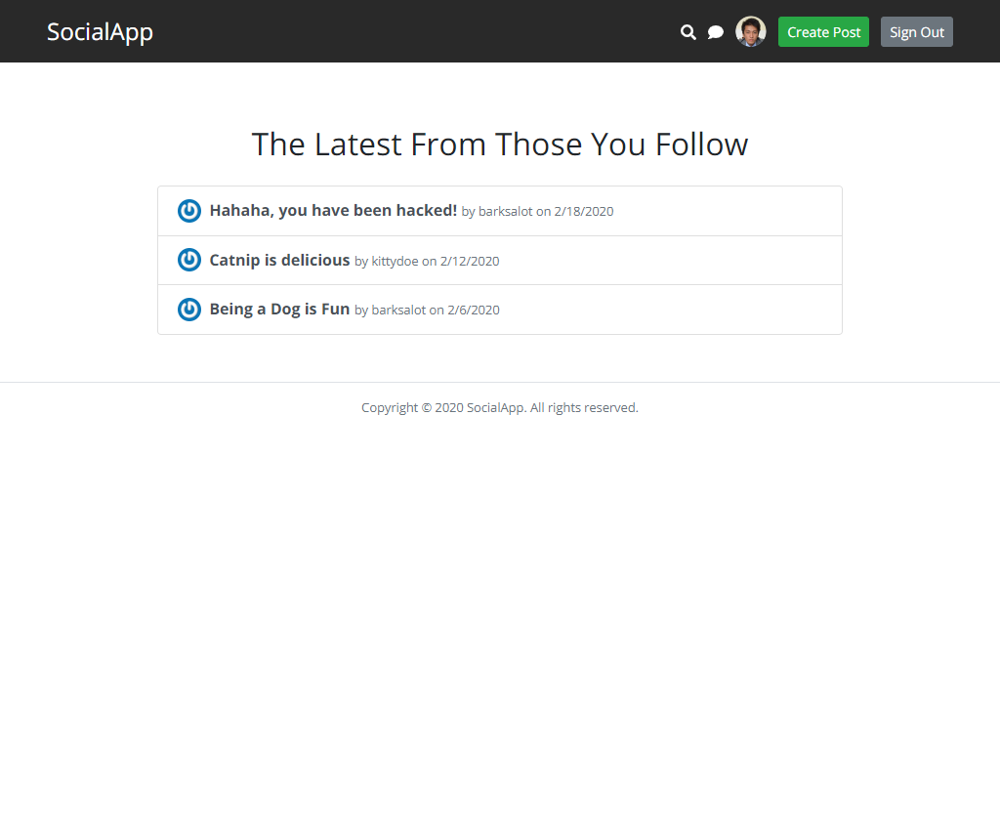

# SocialApp




Visit the [live preview](https://socialsite-app.herokuapp.com/).


## Installation

Clone the repository, change to the directory, and use npm to install dependencies.

```sh
$ git clone hhttps://github.com/genesisgabiola/social-app.git
$ cd social-app
$ npm install
```


## Usage

1. Add `.env` file to your main folder, then add these with your own values

```
CONNECTION_STRING=
PORT=3000
```

2. Run node server and watch for any changes.

```sh
$ npm run watch
```

3. Open your browser and launch the website at [localhost:3000](https://localhost:3000).

4. Register a new username, email & password, then login.


## How to Contribute?

- Open an [issue](https://github.com/genesisgabiola/social-app/issues).
- Contact me on [twitter](http://twitter.com/genesisgabiola).

Any queries, suggestions, issues to report or critics are welcome :) You can freely connect to me.
